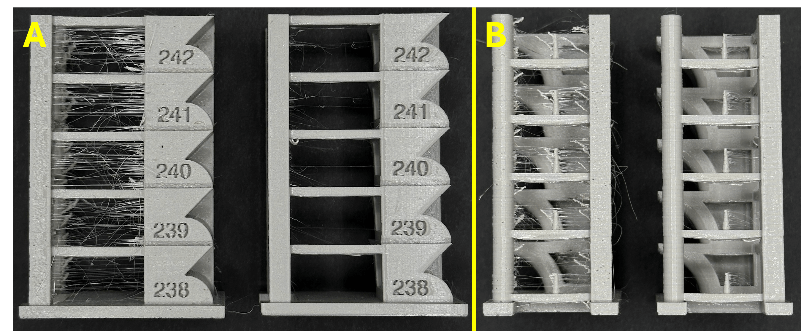

# 3d-printing-stringing-predictor
This project aims to investigate if machine learning can be used to **predict stringing behavior** in 3D-printed parts produced with PETG filament.

## 🔎 Project Overview
Stringing is a common issue in fused deposition modelling (FDM) 3D printing, where thin strands of extruded material form between sections of the print, compromising its aesthetic quality and requiring post-processing to remove. The latter usually involves blowing hot air over the strands to burn them away, or to manually remove them with a cutting tool.

<figure>
  
  <figcaption> Front (A) and side (B) views of a 3D-printed part using PETG. In both views, the left-hand side shows severe stringing due to high moisture content in the filament, while the right-hand side shows the same printing settings after drying the filament. The numbers correspond to printing temperature (hotend).</figcaption>
</figure>

Several factors can contribue to stringing:
- Filament material
- Filament with high moisture content
- Poor-quality filament
- 3D model geometry
- Incorrect print settings (e.g. lack of retraction, too high extruder temperature, slow travel speeds)

Stringing can be minimised *or in some cases eliminated altogether* by controling some of these factors. It might not be possible to change the model or the material used, but most printers allow great flexibility in terms of adjusting print settings, and filament can be dried using fairly common tools.

Determining the optimal values for some of these parameters usually requires trial-and-error, which can be time- and material-consuming. Moreover, calibrating the printer may not guarantee that it'll perform the same over a wide range of 3D geometries. 

The ideia is to print a variety of parts printed using PETG filament under different conditions, and notice the occurence of stringing. Then, train a machine learning model based on these data to predict the severity of stringing for a model and set of conditions.

## 🎯 Objective
Create a ML model that is able to predict stringing severity based on various input factors (e.g. filament, environmental, model shape).

### Deliverables

## Data
TODO

## Model
TODO: neural network

## Tools
- **Python** for machine learning and 3D model vectorization (potentially using PyTorch Geometric)
- **MATLAB** for image analysis and feature extraction from real-world print outputs

## Results
TODO